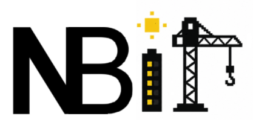

# NextBit

<p align="center">
  
</p>

<p align="center">
  <b>AI-Powered Interactive Software City Visualizer</b><br />
  <i>Software architecture shouldn't be read. It should be explored.</i>
</p>

---

## 🌟 Concept

NextBit transforms software architecture into a navigable, living **3D Garden City**. Instead of staring at intimidating UML diagrams or complex directory trees, developers and students can visually walk through their project before writing the first line of code.

### 🏛️ The Architecture Mapping Hierarchy

| Software Architecture Level | NextBit City Concept | Interactive Representation |
| :--- | :--- | :--- |
| **Project System** | 🏡 **City View** | Top-level 3D software garden overview |
| **Major Architectural Layers** | 🌳 **Districts** | Frontend, Backend, Database, Infrastructure zones |
| **Microservices & Components** | 🏢 **Buildings** | Explorable voxel structures matching service complexity |
| **Submodules & Subsystems** | 🥞 **Floors** | Multi-level vertical component layers |
| **Files & Code Modules** | 📄 **Rooms** | Individual code files with responsibilities & tech stack |

---

## ✨ Features

- 🧠 **Gemini 3.6 Flash Integration**: Real-time structured LLM generation of tailored software architecture blueprints.
- 🌳 **Sunny Pixelated Garden City Aesthetic**: Cozy voxel-inspired art direction with lush grass, pathways, trees, flower beds, and warm daylight.
- 🎯 **Multi-Level Exploration Hierarchy**: Seamlessly navigate `City → Building → Floor → Room` with camera transitions and lerp controls.
- 🍞 **Interactive Breadcrumbs & Navigation**: Clickable breadcrumb paths (`NextBit / Backend / API Gateway / Auth Floor / router.ts`) to instantly jump between architectural levels.
- 🔍 **Rich Architectural Metadata**: Inspect building complexity (1–5), tech stacks, core responsibilities, file languages, and inter-service dependencies.
- ⚡ **Semantic Hierarchy Transformer**: Deterministic frontend transformer ensuring every building features meaningful, domain-specific internal floors and file rooms.

---

## 🎨 Visual Style & Design Philosophy

NextBit follows a **Sunny Software Garden** design philosophy:
- **Cozy & Friendly**: Soft daylight, bright blue skies, green parks, and warm colorful building blocks.
- **No Neon Clutter**: Avoids dark cyberpunk neon themes in favor of clean, readable visual design.
- **Purposeful 3D**: Every voxel block answers *"What part of the software system is this?"*

---

## 🛠️ Tech Stack

### Frontend
- **Framework**: React 18 + Vite + TypeScript
- **3D Graphics Engine**: Three.js + `@react-three/fiber` + `@react-three/drei`
- **Styling**: Tailwind CSS

### Backend
- **Runtime**: Node.js + Express
- **AI SDK**: `@google/genai` (Google Gemini 3.6 Flash API)

---

## 🚀 Getting Started

### Prerequisites
- Node.js (v18+)
- Gemini API Key

### 1. Backend Setup
```bash
cd backend
npm install
```

Create `.env` file in `backend/`:
```env
GEMINI_API_KEY=your_gemini_api_key_here
PORT=5000
```

Start backend dev server:
```bash
npm run dev
```

### 2. Frontend Setup
```bash
cd frontend
npm install
npm run dev
```

Open your browser at `http://localhost:5173`.

---

## 🗺️ Roadmap

- [x] Phase 1: Interactive 3D City Prototype & Navigation
- [x] Phase 2: Live Gemini LLM Architecture Integration
- [x] Phase 3: Hierarchical Exploration (`District → Building → Floor → Room`)
- [x] Phase 4: Sunny Garden Voxel Aesthetic & Brand Identity
- [ ] Phase 5: Code Template Export & GitHub Scaffold Generation

---

## 💙 Vision

Software architecture shouldn't be read.  
It should be explored.

*Walk through your next bit with NextBit.*

Made with ❤️ by Vidisha Jain
